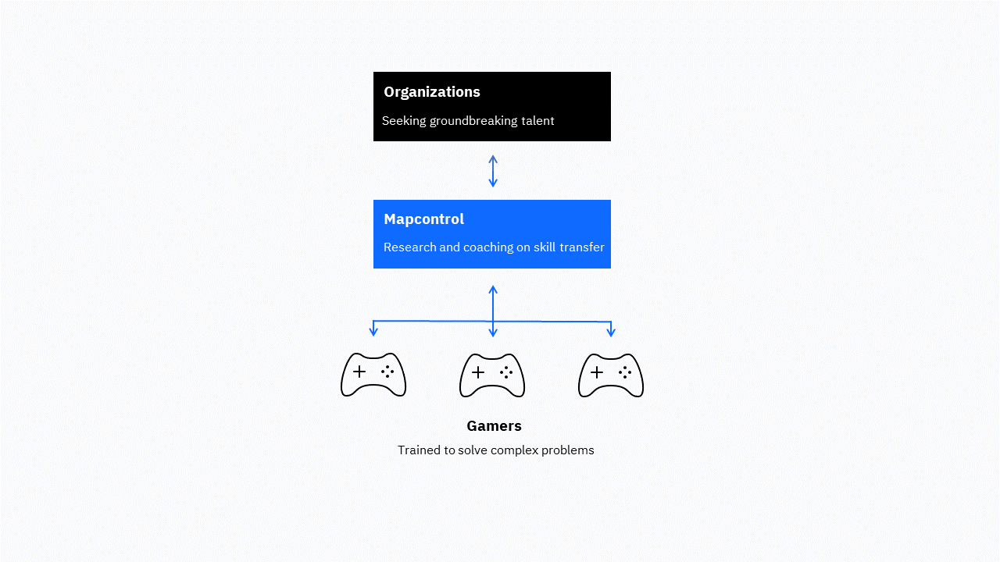

# Mapcontrol - Gaming for Enterprise

## This Repository

Mapcontrol advances the application of gaming skills to real-world problems and careers. This repository is where we document our [beliefs]() about gaming talent and how we [work]() to empower this talent for enterprise. Here, we also explain our [collaboration]() with gamers and organizations to discover how gaming skillsets can best be transferred to our complex world.

</img>

## How It Works

### Core Belief

**We believe that gaming skillsets can be critical assets to organizations in tackling the complex problems of our world.**

Video games are considered entertainment technology for consumer play. But in our complex world, games and gamers have vast potential to contribute to enterprise decision-making. Games like [StarCraft II](https://en.wikipedia.org/wiki/StarCraft_II:_Wings_of_Liberty) or [Dark Souls](https://en.wikipedia.org/wiki/Dark_Souls) train problem-solving skills that are valuable in the real world. Building coherent strategies from limited data, adapting to new events at the needed speed, and decomposing your own performance to thrive in environments with low feedback are some of the skills gamers have honed. 

### What We Do

**We research and provide coaching on the application of gaming skillsets to real-world problems and careers.**

Leading organizations have started to [hire gamers](https://www.businessinsider.com/retired-gamer-offered-internship-for-past-starcraft-2-performance-2019-10) for their problem-solving skills. But there exist no tools that would enable the interaction between gamers and organizations to intensify and scale. With Mapcontrol, we aim to build these tools and empower gaming for enterprise. We research and provide coaching on the skills that games like StarCraft train, how gaming skills can be transferred to real-world problems, and how they can best be presented and assessed in interview situations.

## Collaboration and Coaching

Gaming is all about community. So is gaming for enterprise. Whether you're a gamer excited about applying your gaming skills to your career, or you're working for an organization excited about the potential of gaming talent, we want to work with you.

Please [connect with us]() to 

### For Gamers

We want to learn from your experience, whether in mastering difficult games, or building impactful careers.

### For Organizations

## About

Our team met as students at Johns Hopkins University, where we developed and taught a course on decision-making based on the real-time strategy game StarCraft II and other game-like scenarios for over two years. We empowered decision-makers with games. Now we are using our experience to empower gaming for enterprise.

