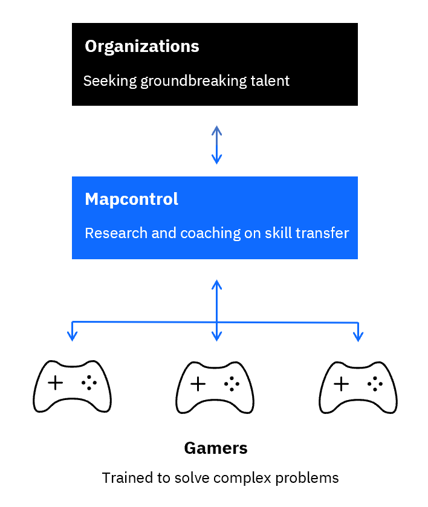

# Mapcontrol

## The Manual

Mapcontrol collaborates with gamers and organizations to advance the application of gaming skills to real-world problems and careers.

</img>

## Why we're here

Video games are considered entertainment technology for consumer play. But in our complex world, games and gamers have vast potential to contribute to enterprise decision-making. We believe that gaming skillsets can be critical assets to organizations in tackling the complex problems of our world. 

**We're here to discover how gaming skills can best be applied to real-world problems and careers.**

### What we do

We collaborate with gamers and organizations to advance the application of gaming skills to real-world problems and careers. We aim to learn from gamers who have established impactful careers, coach gamers seeking career growth and work with organizations to help them understand and connect with gaming talent.

If you believe in empowering gaming for enterprise, [email us]() or [connect on Discord]().

Below is a snapshot of our beliefs about the transferability of gaming skills and an outline of the collaboration we aim to build with gamers and organizations.

## Gaming for enterprise

> "I don't know how to access StarCraft people. No one puts it on their resume."
>
> Tobi Lutke, CEO, Shopify

Playing difficult games like [StarCraft II](https://en.wikipedia.org/wiki/StarCraft_II:_Wings_of_Liberty) or [Dark Souls](https://en.wikipedia.org/wiki/Dark_Souls) means training problem-solving skills that are valuable in the real world. Building coherent strategies from limited data, adapting to new events at the needed speed, and decomposing your own performance to thrive in environments with low feedback are some of the skills gamers have honed. The challenge is how gamers can transfer these skills to real-world problems and careers. 

Leading organizations have started to [hire gamers](https://www.businessinsider.com/retired-gamer-offered-internship-for-past-starcraft-2-performance-2019-10) for their problem-solving skills. But there exist no tools that would enable the interaction between gamers and organizations to intensify and scale. 

The tools needed to match gamers and organizations are:

* Nuanced documentation of the skills that a game like StarCraft II trains
* Clear guidelines on how gaming skills can be transferred to real-world problems
* Best practices for the presentation and assessment of gaming skills in interviews

With Mapcontrol, we aim to build these tools and empower gaming for enterprise.

## Collaboration and coaching

If you're a gamer and excited about connecting your gaming experience to your career, or you're working for an organization interested in accessing the groundbreaking talent of gamers, [connect with us]().

### For gamers

### For organizations

